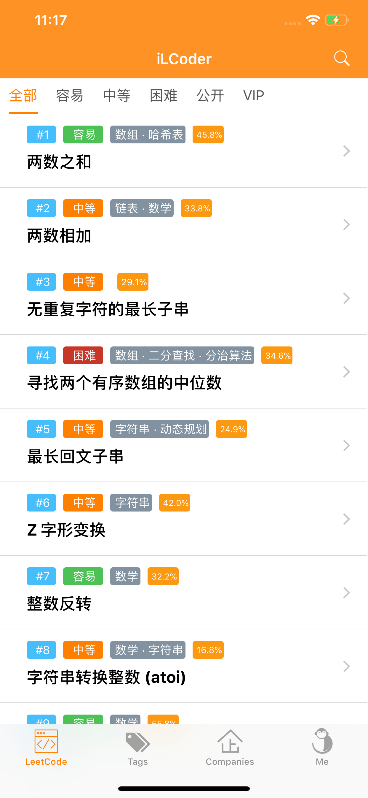
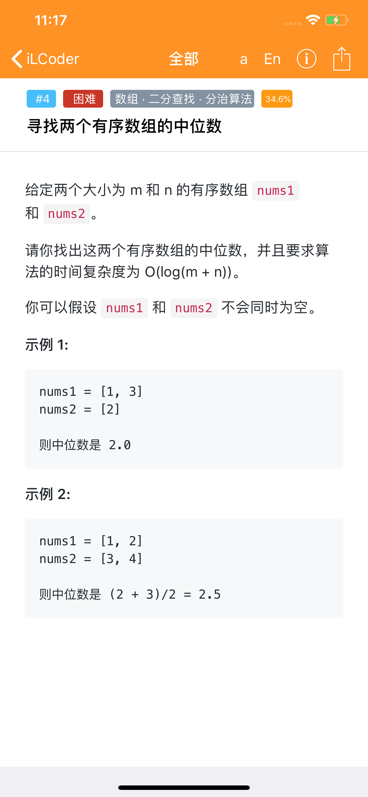
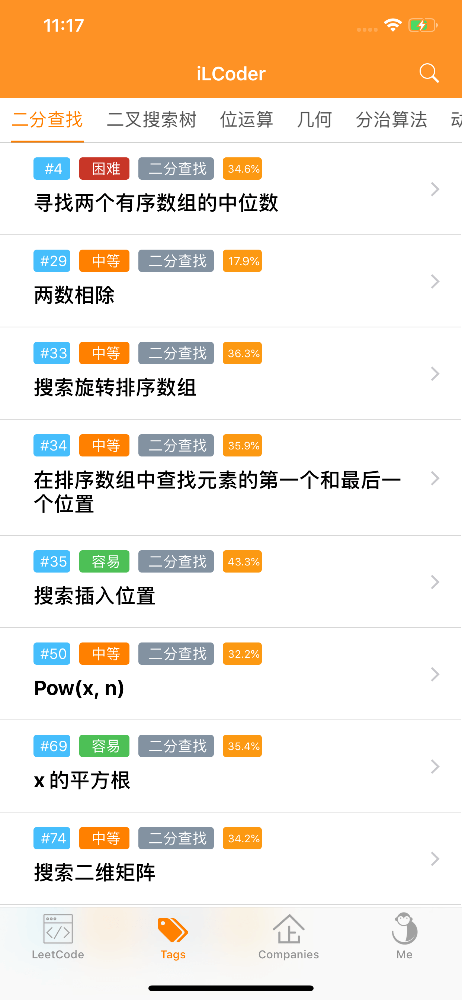
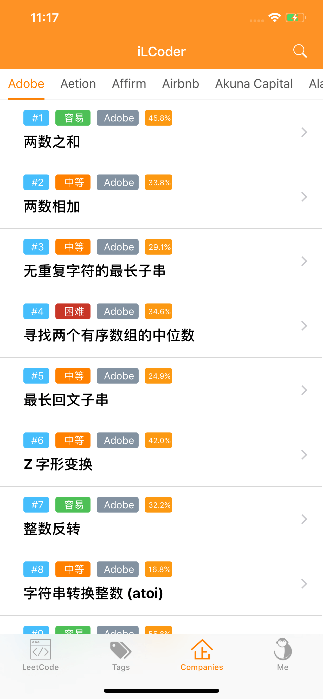
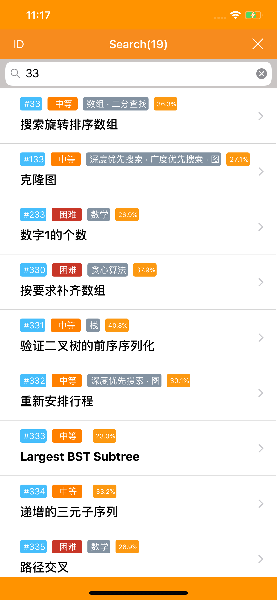
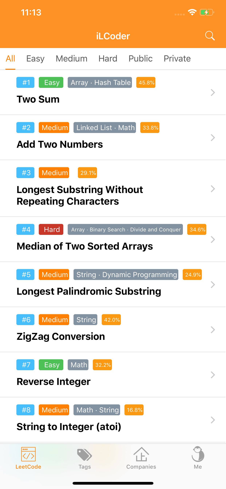
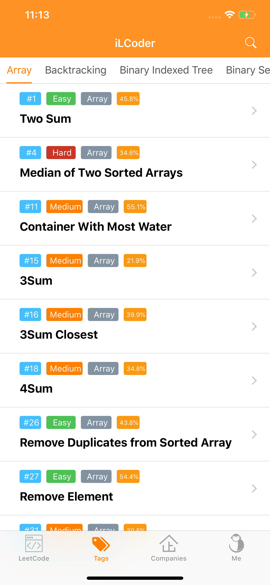
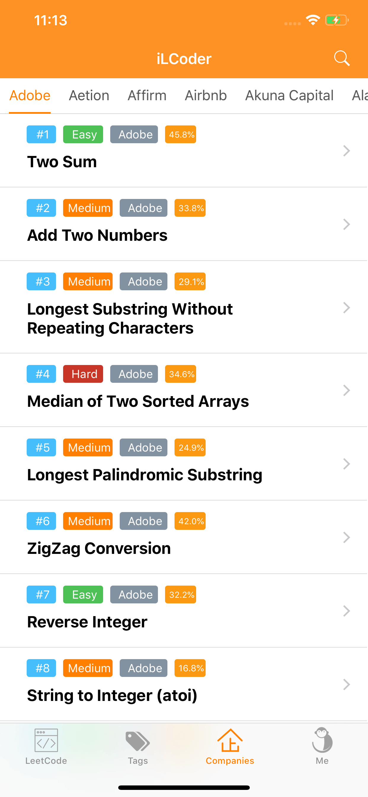

# iCoder
LeetCode question bank  app

### 项目介绍
**iCoder** 是一款为IT进阶者提供算法知识充电的应用，算法和数据结构知识全面学习、面试必备的工具，简单而全面方便的形式呈现更有趣的知识，让大家在零碎时间也可以快速和简单的学习get! 

1、1000+题库，满足你对算法求知欲望！
2、IT企业面试题目，为你完名企的梦！
3、最全算法知识题，为你准备好的面试！
4、强大的搜索引擎，可以任意搜索结果！
5、题目截图分享，与好友一起讨论学习！

- 为什么要使用 iCoder 呢？
iCoder 相比其他编程平台有着很多优势?

#各大知名公司面试真题# 
- 对于求职者在这上面训练更具有针对性，目前很多公司面试时直接从在这上面出题。

#大中小企业都在使用# 
- 常常会直接或者间接使用 LeetCode 的题目资源，依然慢慢成为考核技术能力和思维方式的黄金标准。

#丰富题库、社区活跃# 
- LeetCode 平台具有丰富的题库，分类全面，可以针对自己的弱处做专项训练！

注：
- 承诺应用内永远不会显示广告弹窗，保证您学习过程中，专注和优秀体验！
- 您如果在使用过程中，疑问或建议欢迎评论反馈！感谢支持！谢谢！

### 项目开源
- 本App可以学习到 Swift 开发 iOS App的技术。
- 希望更多人可以一起学习iOS开发或者有需要研究~

### 下载安装
因为苹果开发者账号需要 ￥688 年费，所以 AppStore下载收费请见谅。可自动macOS系统下编译安装，或AppStore付费支持： [iOS App Store](https://itunes.apple.com/cn/app/iCoder/id1458259471?l=zh&ls=1&mt=8)，如果不愿意付费支持，也可以下载本项目代码自行编译安装。

扫二维码下载：

### 应用截图

